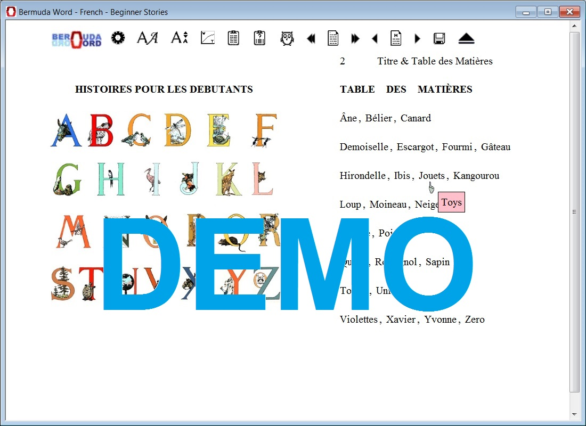
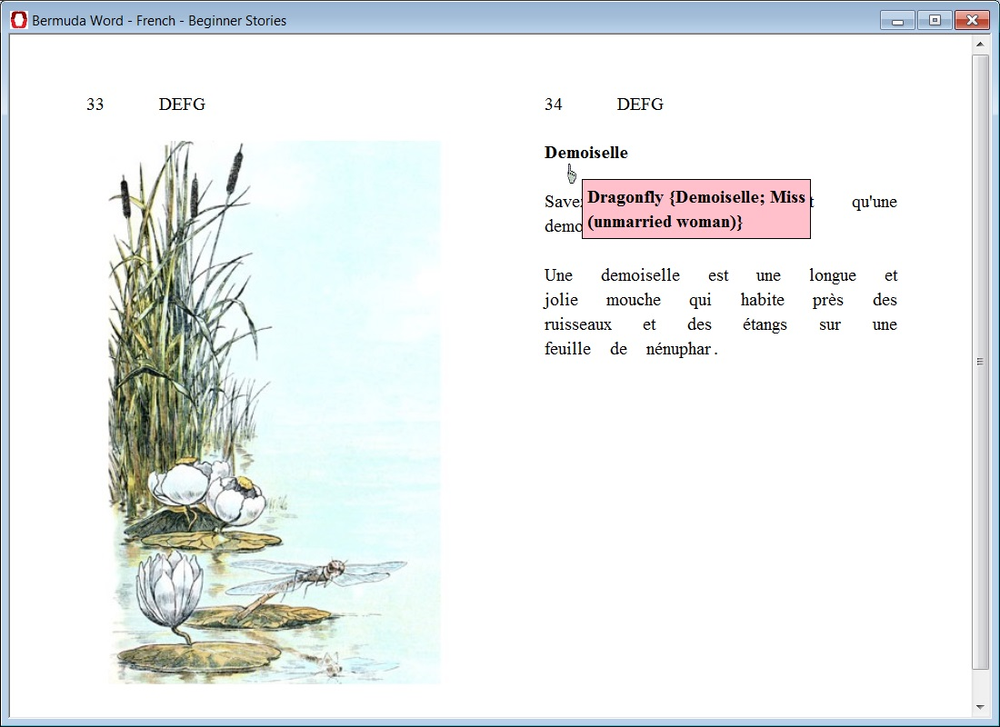

<h1>Bermuda Word</h1>

This is a partial copy of the original Bermuda Word reader for older Windows versions. It is only to show the architecture that was set up to create the 44 different educational Software program executables in ISBN.txt.

The VB files contain the framework that offer the possibility of running the HTML+CSS+Javascript source in an executable, and also the plug-ins necessary to perform back-end tasks like <a href='README.md#DBG'>debugging</a>, <a href='README.md#SET'>persistency</a>, sorting, decryption, tests ui setup or automated registration at bermudaword.com. The perl scripts respectively create a HTML browser package and encrypt that and load it into a single .exe file.

The base directory contains some of the necessary scripts and html files. The language directory would contain the source files and the resulting HTML browser package and is excluded from this repository.

The images show one of the Windows Software programs running, the executable included is a demo version of the full program.

<h3>Framework:</h3>

<i>The framework runs HTML+CSS package and through special Javascript urls specific functionality can be requested from the package to the framework, such as temporarily (configuration in memory) or permanently (in file) saving settings. The framework simply intercepts the url and runs the requested functionality and/or returns the result.</i>

<h6 id="DBG">DBG</h6>
<i>Log message for debugging.</i> 
usage:
"DBG§$MESSAGESTRING" 
example:
top.location.href = "DBG§Checking if TeacherCurrentMyWordsNumber $TEACHERCURRENTMYWORDSNUMBER and TeacherCurrentChapterTestCounter $TEACHERCURRENTCHAPTERTESTCOUNTER are empty:";

<h6 id="SET">SET</h6>
<i>Set configuration data in memory optionally reloading page to show new configuration.</i> 
usage:
top.location.href = "SET§$VARIABLE§$VALUE§$OPTIONAL: NO_REFRESH" (NO_REFRESH used if value does not need to be updated on screen)  
example:
top.location.href = "SET§TEACHERCURRENT + $CHAPTERNUMBER§999§NO_REFRESH";

<h6 id="DEL">DEL</h6>
<i>Delete certain educational personal data (my word).</i> 
usage:
top.location.href = "DEL§$reference"§OPTIONAL: NO_REFRESH"; 
example:
top.location.href = "DEL§PAGE_WORD_$WordCode§FLCREF_NORFR";

<h6 id="CLK">CLK</h6>
<i>Add certain data specified by choice (clicked word to my word for example).</i> 
usage:
top.location.href = "CLK§$Choice§NO_REFRESH"; 
example:

<h6 id="SVF">SVF</h6>
<i>Save file</i> 
usage:
top.location.href = "SVF§$file"; 
example:
top.location.href = "SVF§FinishedUniqueWordsFile.htm";

<h6 id="GET">GET</h6>
<i>Get file including menu and main templates</i> 
usage:
top.location.href = "GET§$BASEHTMLFILEPARTMainSmallMenu.htm<>$NextChapterPage<>§Finished$TRANLANGOTHERTHANENG.htm§$PAGETABLE§NO"; 
example:
top.location.href = "GET§$headerfile<>$dummy<>§$targetfile§$template§NO";

<h6 id="CFG">CFG</h6>
<i>Run configuation item or group</i> 
usage:
top.location.href = "CFG§$THEME_OR_CONFIGURATION_GROUP_TO_SET§OPTIONAL: PARSE (PARSE if this influences other variables and need reparsing of all settings, for example in case CFG group influences certain SETs) 
example:
top.location.href = "CFG§LAYOUTSINGLE§PARSE";

<h6 id="AUD">AUD</h6>
<i>Play audio file.</i> 
usage:
top.location.href = "AUD§$audiofile_or_dummy"
example:
top.location.href = "AUD§TheThreeBearsPage1.mp3"

<h3>Screenprints:</h3>

</img>

</img>
